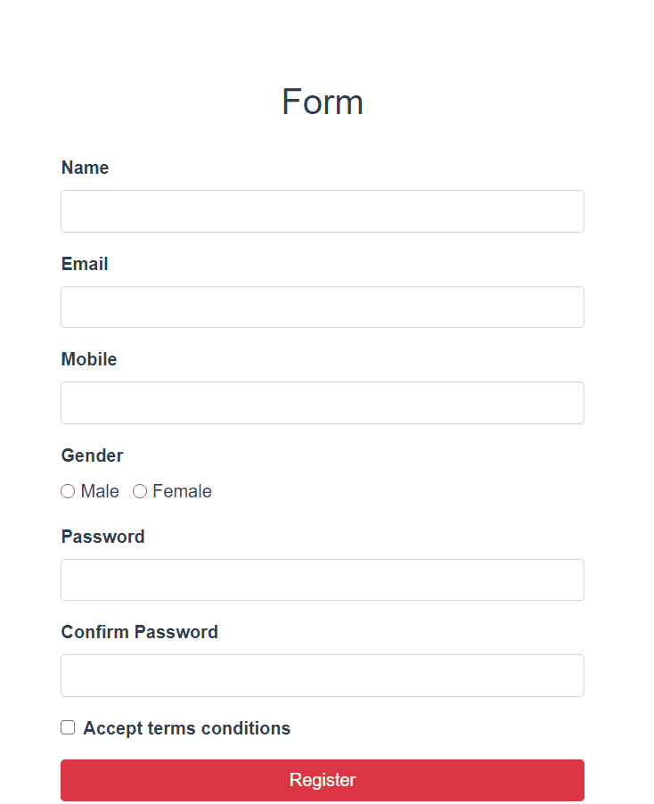

# Форма с валидацией на Vue.js

## Выполнено [Уткиным Данилом](https://github.com/DanilKlukanov) и [Клюкановой Дианой](https://github.com/alexmasterblack)
## Б8119-01.03.02систпро
## [Deploy on Heroku](https://vue-validation-form.herokuapp.com/)

